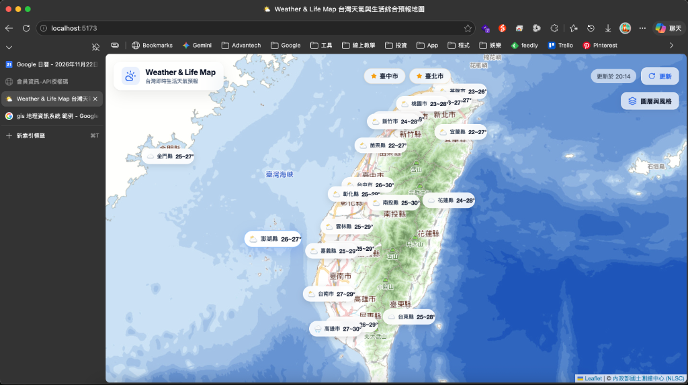

# Weather & Life Map (台灣天氣與生活綜合預報地圖)

> 專為台灣打造的「地圖優先 (Map-First)」現代生活天氣資訊視覺化系統。  
> 擺脫死板的純文字表格，將即時氣溫、降雨機率與生活出行提醒直覺呈現在互動地圖上，並搭配精緻的**玻璃擬物化 (Glassmorphism)** 設計風格。

---

## 🔗 線上體驗 (Live Demo)

- 🌐 **正式上線網址**：**[https://ncuh-weather-forecast.vercel.app](https://ncuh-weather-forecast.vercel.app)**
- ⚡ **自動化持續部署**：已由 Vercel 連動 GitHub 自動建置與發布。



---

## 🌟 核心特色 (Key Features)

- 🗺️ **滿版互動地圖 (Map-First)**：以台灣為中心的全螢幕 Web GIS 地圖，直觀瀏覽 22 縣市即時氣候徽章。
- 🎨 **玻璃擬物化 (Glassmorphism) 美學**：全域半透明毛玻璃面板（`backdrop-filter: blur`）與微光光暈，打造頂級科技感與空氣感視覺。
- 🌤️ **中央氣象署 (CWA) 官方 API 串接**：介接 36 小時天氣預報，即時解析氣溫範圍、降雨機率與天氣現象。
- 🧭 **多樣底圖風格熱切換**：
  - 🤍 **極簡淡雅 (Esri Gray)**：現代淺灰純淨畫布，凸顯氣象數據（預設）。
  - ⛰️ **自然地形 (Esri Topo)**：立體等高線與地貌質感。
  - 🗺️ **臺灣通用電子地圖 (NLSC)**：內政部官方正體中文詳細街道。
  - 🌐 **開源標準 (OSM)**：OpenStreetMap 經典配色。
- ☁️ **Supabase 雲端持久化儲存**：
  - 免繁瑣登入的**裝置同步碼 (Sync ID)** 機制。
  - 收藏「我的最愛城市」與「底圖偏好」即時同步至雲端 PostgreSQL 資料庫，支援跨瀏覽器/裝置同步。
  - **自動降級保護**：無網路或未配置資料庫時，自動無縫退回 LocalStorage 本機模式。
- 💡 **生活出行情境提醒**：根據降雨機率與溫差，動態提供「攜帶雨具」、「防曬多補水」、「洋蔥式穿搭」等貼心建議。

---

## 🛠️ 技術棧 (Tech Stack)

| 領域 | 技術 / 函式庫 | 說明 |
| :--- | :--- | :--- |
| **前端框架** | React 18 + Vite 5 | 快速建置、極致模組化開發體驗 |
| **Web GIS 引擎** | Leaflet + React-Leaflet | 開源互動式地理資訊系統與自訂 DOM 標記 (DivIcon) |
| **圖磚服務協定** | XYZ Tiling Scheme / WMTS | Web Mercator (EPSG:3857) 動態切片金字塔 |
| **視覺與樣式** | Vanilla CSS3 (Glassmorphism) | GPU 硬體加速毛玻璃濾鏡與響應式 RWD |
| **雲端資料庫** | Supabase (PostgreSQL) | 提供即時 REST API 與 Row Level Security (RLS) |
| **圖示庫** | Lucide React | 清新現代的向量 Icon |
| **部署平台** | Vercel | 現代化邊緣網路與自動化 CI/CD 部署 |

---

## 🚀 本地開發啟動 (Getting Started)

### 1. 複製儲存庫
```bash
git clone git@github.com:contemplator/ncuh-weather-forecast.git
cd ncuh-weather-forecast
```

### 2. 安裝相依套件
```bash
npm install
```

### 3. 配置環境變數
請複製 `.env.example` 為 `.env`，並填入你的金鑰：
```bash
cp .env.example .env
```
編輯 `.env`：
```env
# 中央氣象署 API 授權碼 (必填，至 https://opendata.cwa.gov.tw/ 申請)
VITE_CWA_API_KEY=your_cwa_api_key_here

# Supabase 雲端資料庫 (選填，若未填將自動以 LocalStorage 本機模式運行)
VITE_SUPABASE_URL=https://your-project-id.supabase.co
VITE_SUPABASE_ANON_KEY=your_supabase_anon_key_here
```

### 4. 啟動開發伺服器
```bash
npm run dev
```
瀏覽器開啟 **http://localhost:5173/** 即可開始體驗！

---

## 🌐 部署至 Vercel 指南 (Deployment)

本專案支援一鍵部署至 **Vercel**：

1. 將程式碼推送到 GitHub 儲存庫：
   ```bash
   git push origin main
   ```
2. 前往 **[Vercel Dashboard](https://vercel.com/new)**，點擊 **Add New ➔ Project**。
3. 匯入此 GitHub 儲存庫（`ncuh-weather-forecast`）。
4. 在 **Environment Variables** 區塊填入以下環境變數：
   - `VITE_CWA_API_KEY`
   - `VITE_SUPABASE_URL`
   - `VITE_SUPABASE_ANON_KEY`
5. 點擊 **Deploy**，約 1 分鐘即可取得公開專屬網址！

---

## 📂 專案文件導覽

- [`SPEC.md`](./SPEC.md): 專案功能規格與技術架構設計書。
- [`task.md`](./task.md): 各階段 (Phase 1 ~ Phase 3) 任務清單與驗證標準。
- [`Agents.md`](./Agents.md): AI Agent 協作規範與安全防護守則。
- [`.env.example`](./.env.example): 環境變數設定範例檔。
